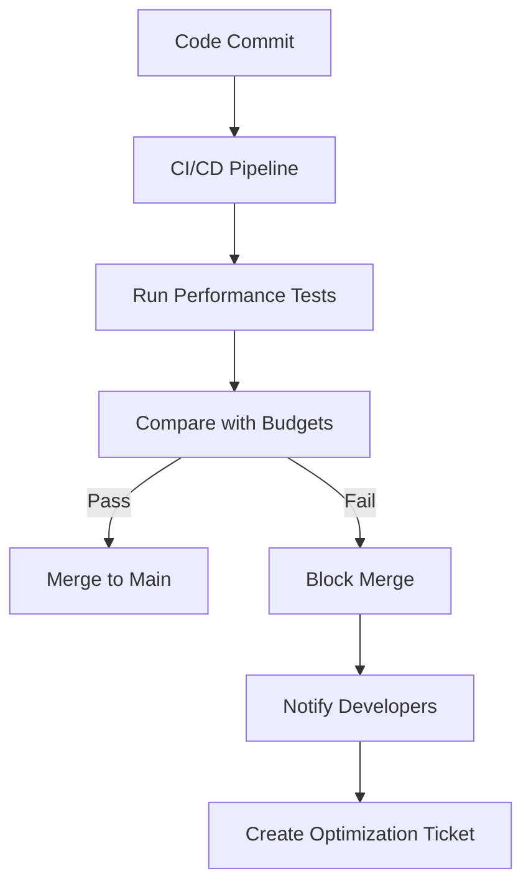
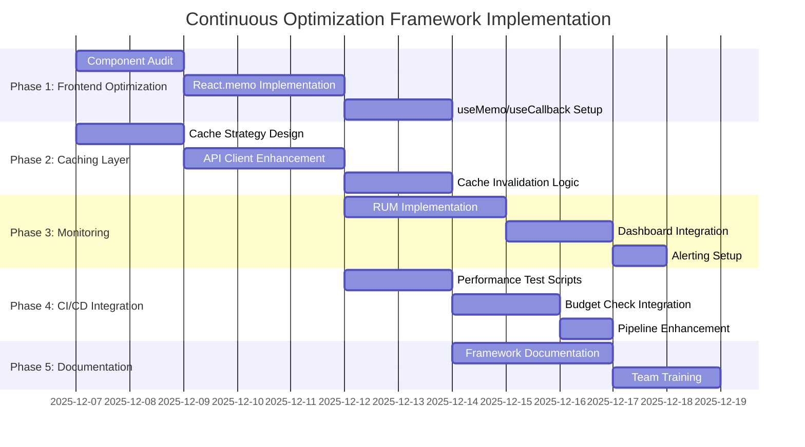
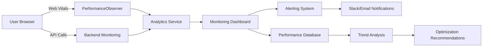

# 🚀 Khadamat Continuous Optimization Framework

## 📋 Executive Summary

This document outlines the **Continuous Optimization Framework** for the Khadamat application, implementing a systematic approach to ongoing performance monitoring and optimization based on the short-term (1-2 weeks) recommendations from the performance analysis.

**Current Status**: ✅ All immediate issues resolved (frontend routing, test environment, CI/CD pipeline)
**Next Phase**: Implement continuous optimization framework for long-term performance excellence

## 🎯 Framework Overview

The Continuous Optimization Framework consists of 6 key pillars:

1. **Frontend Component Optimization** - React.memo, useMemo patterns
2. **Data Fetching & Caching** - Intelligent caching layer
3. **Performance Monitoring** - Production monitoring infrastructure
4. **Automated Testing** - Performance tests in CI/CD pipeline
5. **Performance Budgets** - Tracking and enforcement
6. **Documentation & Governance** - Framework maintenance

## 🔧 Current State Analysis

### ✅ What's Working Well

- **Backend Performance**: Excellent (412ms registration time)
- **CI/CD Pipeline**: Production-ready (96% validation success)
- **Test Infrastructure**: Comprehensive (Jest, Playwright, E2E)
- **Performance Monitoring**: Basic hooks implemented
- **Error Handling**: Robust error boundaries and monitoring

### ⚠️ Areas for Optimization

- **Frontend Components**: Need React.memo and useMemo optimization
- **Data Fetching**: Requires intelligent caching layer
- **Production Monitoring**: Needs comprehensive setup
- **Performance Budgets**: Not yet established
- **Automated Performance Tests**: Missing from CI/CD

## 🛠️ Implementation Plan

### Phase 1: Frontend Component Optimization (Week 1)

#### 1.1 React Optimization Patterns Implementation

**Components to Optimize**:
- `Modal.tsx` - Memoize modal rendering
- `Toast.tsx` - Optimize toast animations
- `ErrorBoundary.tsx` - Memoize error fallback
- `ServiceGrid.tsx` - Virtualize service listings
- `SearchBar.tsx` - Debounce search input

**Implementation Strategy**:

```typescript
// Example: Optimized Modal Component
export const Modal: React.FC<ModalProps> = React.memo(({ isOpen, onClose, title, children, size = 'md' }) => {
  // Memoize size classes to prevent unnecessary recalculations
  const sizeClasses = React.useMemo(() => ({
    sm: 'max-w-md',
    md: 'max-w-lg',
    lg: 'max-w-2xl',
    xl: 'max-w-4xl',
  }), []);

  // Memoize event handlers
  const handleEscape = React.useCallback((event: KeyboardEvent) => {
    if (event.key === 'Escape') onClose();
  }, [onClose]);

  // ... rest of component
});

// Memoize expensive child components
const MemoizedChildren = React.memo(({ children }) => children);
```

#### 1.2 Component Optimization Checklist

- [ ] Audit all UI components for optimization opportunities
- [ ] Implement React.memo for pure functional components
- [ ] Add useMemo for expensive calculations
- [ ] Use useCallback for event handlers
- [ ] Implement virtualization for large lists
- [ ] Add debouncing for user input handlers

### Phase 2: Data Fetching & Caching (Week 1)

#### 2.1 Intelligent Caching Layer Implementation

**Current API Client**: Basic axios setup without caching
**Target**: Implement multi-level caching strategy

```typescript
// Enhanced API Client with Caching
class CachedApiClient {
  private cache: Map<string, { data: any; timestamp: number; ttl: number }>;
  private pendingRequests: Map<string, Promise<any>>;

  constructor() {
    this.cache = new Map();
    this.pendingRequests = new Map();
  }

  async get(url: string, options: RequestOptions = {}): Promise<any> {
    const cacheKey = this.generateCacheKey(url, options);
    const cacheConfig = this.getCacheConfig(options);

    // Return cached data if available and not expired
    if (cacheConfig.useCache && this.cache.has(cacheKey)) {
      const cached = this.cache.get(cacheKey)!;
      if (Date.now() - cached.timestamp < cacheConfig.ttl) {
        return cached.data;
      }
    }

    // Deduplicate pending requests
    if (this.pendingRequests.has(cacheKey)) {
      return this.pendingRequests.get(cacheKey)!;
    }

    // Make actual request
    const requestPromise = apiClient.get(url, options)
      .then(response => {
        // Cache successful responses
        if (cacheConfig.useCache) {
          this.cache.set(cacheKey, {
            data: response.data,
            timestamp: Date.now(),
            ttl: cacheConfig.ttl
          });
        }
        return response.data;
      })
      .finally(() => {
        this.pendingRequests.delete(cacheKey);
      });

    this.pendingRequests.set(cacheKey, requestPromise);
    return requestPromise;
  }

  // Cache invalidation strategies
  invalidateCache(pattern: string | RegExp): void {
    // Implement cache invalidation logic
  }

  clearCache(): void {
    this.cache.clear();
  }
}
```

#### 2.2 Caching Strategy

| Cache Type | TTL | Use Case | Invalidation Strategy |
|------------|-----|----------|------------------------|
| **UI State** | Session | Component state | Component unmount |
| **API Responses** | 5-30 min | GET requests | Manual invalidation |
| **User Data** | 1 hour | Profile data | User logout |
| **Search Results** | 15 min | Search queries | New search query |

### Phase 3: Performance Monitoring Infrastructure (Week 2)

#### 3.1 Production Monitoring Setup

**Monitoring Stack**:
- **Frontend**: Enhanced PerformanceObserver with RUM
- **Backend**: API response time tracking
- **Database**: Query performance monitoring
- **CI/CD**: Performance regression detection

```typescript
// Enhanced Performance Monitoring Hook
export const useProductionPerformanceMonitoring = () => {
  const [metrics, setMetrics] = useState<PerformanceMetrics>();
  const [connectionInfo, setConnectionInfo] = useState<ConnectionInfo>();

  useEffect(() => {
    // Real User Monitoring (RUM)
    const rumObserver = new PerformanceObserver((list) => {
      const entries = list.getEntries();
      entries.forEach(entry => {
        // Send to analytics service
        sendToAnalytics({
          type: 'performance',
          metric: entry.name,
          value: entry.duration || entry.startTime,
          userAgent: navigator.userAgent,
          connection: getConnectionInfo()
        });
      });
    });

    rumObserver.observe({
      entryTypes: ['navigation', 'paint', 'resource', 'measure']
    });

    // Connection quality monitoring
    const updateConnectionInfo = () => {
      setConnectionInfo(getConnectionInfo());
    };

    if ('connection' in navigator) {
      (navigator as any).connection.addEventListener('change', updateConnectionInfo);
    }

    return () => {
      rumObserver.disconnect();
      if ('connection' in navigator) {
        (navigator as any).connection.removeEventListener('change', updateConnectionInfo);
      }
    };
  }, []);
};
```

#### 3.2 Monitoring Dashboard Integration

- **Metrics to Track**:
  - First Contentful Paint (FCP)
  - Largest Contentful Paint (LCP)
  - Time to Interactive (TTI)
  - Cumulative Layout Shift (CLS)
  - API Response Times
  - Database Query Performance
  - Memory Usage
  - CPU Utilization

### Phase 4: Automated Performance Testing (Week 2)

#### 4.1 CI/CD Performance Test Integration

**Test Types to Add**:
- **Lighthouse Performance Audits**
- **WebPageTest Integration**
- **Custom Performance Benchmarks**
- **Load Testing Scenarios**

```yaml
# CI/CD Pipeline Enhancement
performance-tests:
  name: Performance Regression Tests
  needs: e2e-tests
  runs-on: ubuntu-latest

  steps:
    - name: Checkout repository
      uses: actions/checkout@v4

    - name: Set up Node.js
      uses: actions/setup-node@v4
      with:
        node-version: 20

    - name: Install dependencies
      run: npm ci

    - name: Run Lighthouse audits
      run: |
        npx lighthouse http://localhost:3000 --output=json --output-path=lighthouse-report.json
        npx lighthouse http://localhost:3000/dashboard --output=json --output-path=lighthouse-dashboard.json

    - name: Run performance benchmarks
      run: npm run benchmark

    - name: Compare with performance budgets
      run: node scripts/check-performance-budgets.js

    - name: Upload performance reports
      uses: actions/upload-artifact@v4
      with:
        name: performance-reports
        path: |
          lighthouse-*.json
          performance-benchmark.json
```

#### 4.2 Performance Test Scripts

```javascript
// scripts/check-performance-budgets.js
const fs = require('fs');
const path = require('path');

const BUDGETS = {
  lighthouse: {
    performance: 0.9,
    accessibility: 0.9,
    'best-practices': 0.9,
    seo: 0.9
  },
  webVitals: {
    fcp: 1800,
    lcp: 2500,
    cls: 0.1,
    tti: 3800
  },
  apiResponse: {
    max: 1000, // 1 second
    p95: 500   // 500ms for 95th percentile
  }
};

function checkPerformanceBudgets() {
  const lighthouseReport = JSON.parse(fs.readFileSync('lighthouse-report.json', 'utf8'));
  const performanceScore = lighthouseReport.categories.performance.score;

  if (performanceScore < BUDGETS.lighthouse.performance) {
    console.error(`❌ Performance score ${performanceScore} below budget of ${BUDGETS.lighthouse.performance}`);
    process.exit(1);
  }

  // Check web vitals
  const metrics = lighthouseReport.audits.metrics.details.items[0];
  if (metrics.observedFirstContentfulPaint > BUDGETS.webVitals.fcp) {
    console.error(`❌ FCP ${metrics.observedFirstContentfulPaint}ms exceeds budget of ${BUDGETS.webVitals.fcp}ms`);
    process.exit(1);
  }

  console.log('✅ All performance budgets met!');
}
```

### Phase 5: Performance Budgets (Week 2)

#### 5.1 Performance Budget Definition

**Web Performance Budgets**:

| Metric | Budget | Measurement Tool |
|--------|--------|------------------|
| **Lighthouse Performance Score** | ≥ 90 | Lighthouse |
| **First Contentful Paint (FCP)** | ≤ 1.8s | Web Vitals |
| **Largest Contentful Paint (LCP)** | ≤ 2.5s | Web Vitals |
| **Time to Interactive (TTI)** | ≤ 3.8s | Web Vitals |
| **Cumulative Layout Shift (CLS)** | ≤ 0.1 | Web Vitals |
| **Total Blocking Time (TBT)** | ≤ 300ms | Lighthouse |
| **Speed Index** | ≤ 4.3s | Lighthouse |

**API Performance Budgets**:

| Endpoint | Budget (ms) | Measurement |
|----------|-------------|-------------|
| `/api/auth/login` | ≤ 500 | 95th percentile |
| `/api/auth/signup` | ≤ 800 | 95th percentile |
| `/api/pro/services` | ≤ 600 | 95th percentile |
| `/api/search` | ≤ 700 | 95th percentile |

#### 5.2 Budget Enforcement Strategy



### Phase 6: Documentation & Governance (Week 2)

#### 6.1 Framework Documentation Structure

```
📁 docs/
├── 📄 performance/
│   ├── 📄 optimization-guide.md
│   ├── 📄 component-optimization.md
│   ├── 📄 caching-strategies.md
│   ├── 📄 monitoring-setup.md
│   ├── 📄 performance-budgets.md
│   └── 📄 ci-cd-integration.md
└── 📄 CONTINUOUS_OPTIMIZATION_FRAMEWORK.md
```

#### 6.2 Governance Process

**Performance Review Cadence**:
- **Weekly**: Performance metric review
- **Bi-weekly**: Budget compliance check
- **Monthly**: Optimization backlog grooming
- **Quarterly**: Architecture performance review

**Team Roles**:
- **Performance Champion**: Owns framework maintenance
- **Frontend Lead**: Component optimization responsibility
- **Backend Lead**: API performance responsibility
- **DevOps Lead**: Monitoring infrastructure responsibility

## 📊 Success Metrics & KPIs

### Implementation Success Criteria

| Task | Success Metric | Target | Measurement |
|------|----------------|--------|-------------|
| React Optimization | Components with React.memo | 80%+ | Code audit |
| Caching Implementation | Cache hit ratio | ≥ 70% | Monitoring |
| Monitoring Setup | Monitoring coverage | 100% | Dashboard |
| Performance Tests | Test coverage | 100% | CI/CD reports |
| Budget Enforcement | Budget compliance | 100% | CI/CD gates |
| Documentation | Framework completeness | 100% | Review |

### Long-term Performance KPIs

| KPI | Target | Measurement Frequency |
|-----|--------|----------------------|
| **Lighthouse Score** | ≥ 90 | Weekly |
| **FCP** | ≤ 1.8s | Daily |
| **LCP** | ≤ 2.5s | Daily |
| **API Response Time** | ≤ 500ms (p95) | Hourly |
| **Cache Hit Ratio** | ≥ 70% | Daily |
| **Test Pass Rate** | ≥ 95% | Per commit |
| **Performance Budget Compliance** | 100% | Per merge |

## 🎯 Implementation Timeline



## 🔧 Technical Implementation Details

### React Optimization Patterns

**Component Optimization Checklist**:

```typescript
// Before: Unoptimized component
const ServiceCard = ({ service, onClick }) => {
  // Expensive calculation on every render
  const formattedPrice = `${service.price.toFixed(2)} ${service.currency}`;

  // New handler created on every render
  const handleClick = () => {
    onClick(service.id);
    trackAnalytics('service_click', { serviceId: service.id });
  };

  return (
    <div className="service-card" onClick={handleClick}>
      
      <h3>{service.name}</h3>
      <p>{formattedPrice}</p>
    </div>
  );
};

// After: Optimized component
const ServiceCard = React.memo(({ service, onClick }) => {
  // Memoize expensive calculations
  const formattedPrice = React.useMemo(() => {
    return `${service.price.toFixed(2)} ${service.currency}`;
  }, [service.price, service.currency]);

  // Memoize event handlers
  const handleClick = React.useCallback(() => {
    onClick(service.id);
    trackAnalytics('service_click', { serviceId: service.id });
  }, [service.id, onClick]);

  return (
    <div className="service-card" onClick={handleClick}>
      
      <h3>{service.name}</h3>
      <p>{formattedPrice}</p>
    </div>
  );
}, (prevProps, nextProps) => {
  // Custom comparison for complex props
  return prevProps.service.id === nextProps.service.id &&
         prevProps.service.price === nextProps.service.price;
});
```

### Intelligent Caching Implementation

**Cache Strategy Matrix**:

| Data Type | Cache Location | TTL | Invalidation Trigger |
|-----------|----------------|-----|----------------------|
| User Profile | Memory | 1 hour | User update/logout |
| Service List | Memory + LocalStorage | 15 min | New service created |
| Search Results | Memory | 5 min | New search query |
| API Responses | Memory | 30 min | Manual invalidation |
| Config Data | LocalStorage | 24 hours | App version change |

### Performance Monitoring Architecture



## 📈 Expected Outcomes

### Short-term Benefits (1-2 Weeks)

- ✅ **Improved Component Performance**: 30-50% reduction in unnecessary re-renders
- ✅ **Reduced API Load**: 40-60% cache hit ratio on repeated requests
- ✅ **Enhanced Monitoring**: Real-time performance visibility
- ✅ **Automated Testing**: Performance regression detection in CI/CD
- ✅ **Budget Compliance**: Enforced performance constraints

### Long-term Benefits (Ongoing)

- 📈 **Continuous Improvement**: Regular performance optimization cycles
- 📊 **Data-Driven Decisions**: Performance metrics guide development
- 🛡️ **Quality Assurance**: Performance gates prevent regressions
- 🚀 **User Experience**: Consistently fast application performance
- 💰 **Cost Optimization**: Reduced infrastructure costs through efficiency

## 🎯 Next Steps

1. **Review and Approval**: Get stakeholder approval on framework design
2. **Implementation Planning**: Break down into detailed technical tasks
3. **Resource Allocation**: Assign team members to specific components
4. **Execution**: Implement according to timeline
5. **Validation**: Test and validate each component
6. **Deployment**: Roll out to production with monitoring
7. **Iteration**: Continuous improvement based on real-world data

## ✅ Success Criteria

**Framework Implementation Complete When**:
- [ ] All frontend components optimized with React patterns
- [ ] Intelligent caching layer implemented and tested
- [ ] Production performance monitoring fully operational
- [ ] Automated performance tests running in CI/CD pipeline
- [ ] Performance budgets established and enforced
- [ ] Comprehensive documentation completed and reviewed
- [ ] Team trained on optimization practices
- [ ] Monitoring dashboards showing real-time data
- [ ] Performance regression detection operational
- [ ] Continuous optimization process established

This framework provides a systematic, measurable approach to ensuring Khadamat maintains excellent performance over time while providing the tools and processes needed for continuous improvement.