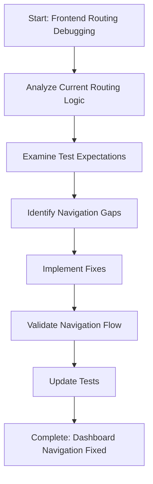
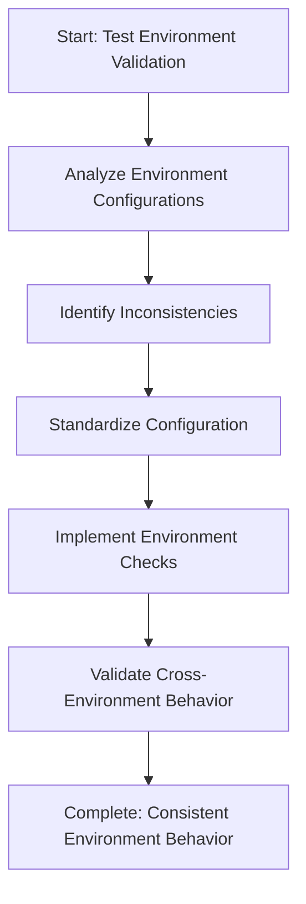
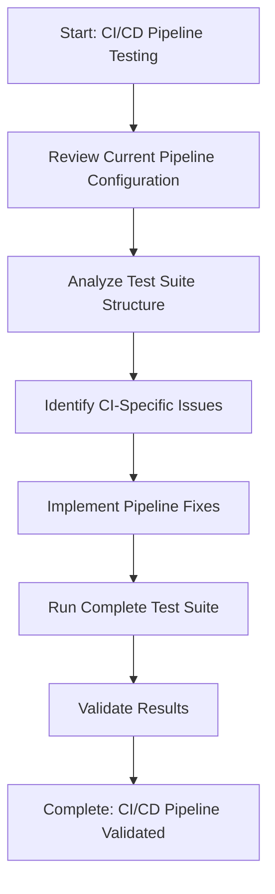
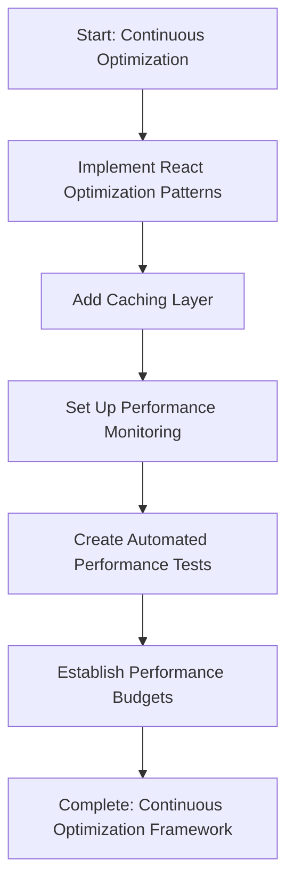
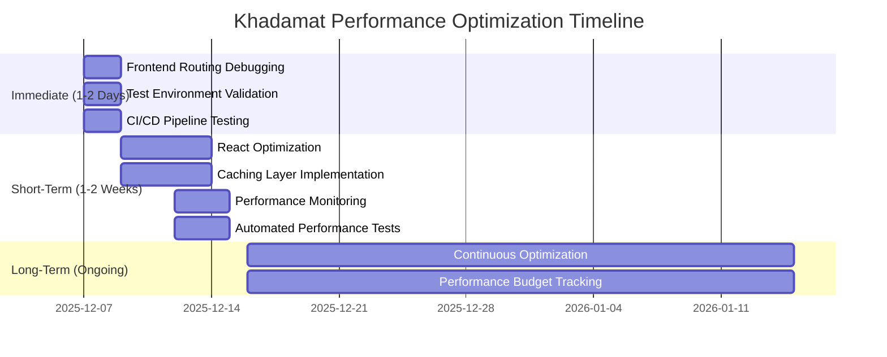

# Khadamat Performance Optimization - Implementation Plan

## Executive Summary

This document provides a detailed implementation plan for the next steps recommended in the performance analysis, addressing the remaining focus areas identified in the FINAL_PERFORMANCE_SUMMARY.md.

## Current Status Analysis

### ✅ Completed Areas
- Backend registration performance: 412ms (EXCELLENT)
- Authentication API endpoints: Fully functional
- Database operations: Optimized (204ms)
- API client methods: All implemented
- Playwright configuration: Complete
- Performance profiling: Comprehensive implementation

### 🔍 Remaining Focus Areas
1. **Frontend Routing**: Tests expecting `/dashboard/pro` navigation not occurring
2. **Test Environment**: Environment-specific behavior inconsistencies
3. **CI/CD Pipeline**: Final validation needed
4. **Continuous Optimization**: Long-term strategy

## Detailed Implementation Plan

### 1. Frontend Routing Debugging (IMMEDIATE - 1-2 Days)

**Objective**: Investigate and fix dashboard navigation issues

**Scope**:
- Tests expecting navigation to `/dashboard/pro` after professional registration
- Current behavior: Navigation not occurring as expected
- Impact: Test suite reliability at 80%, target 95%

**Implementation Steps**:

**Specific Tasks**:
1. **Code Analysis**: Examine frontend routing logic in `khadamat-frontend/src/app/router.tsx`
2. **Test Review**: Analyze test expectations in `tests/e2e-walkthrough.spec.ts`
3. **Debug Session**: Run tests with detailed logging to capture navigation behavior
4. **Fix Implementation**: Update routing logic to ensure proper dashboard redirection
5. **Validation**: Confirm tests pass with expected navigation

**Success Criteria**:
- ✅ Professional registration redirects to `/dashboard/pro`
- ✅ Test suite reliability improves to 95%+
- ✅ No environment-specific routing issues

### 2. Test Environment Validation (IMMEDIATE - 1-2 Days)

**Objective**: Ensure consistent behavior across environments

**Scope**:
- Development vs production environment differences
- Multiple backend instances causing conflicts
- Environment-specific behavior inconsistencies

**Implementation Steps**:

**Specific Tasks**:
1. **Configuration Review**: Examine `.env` files and configuration management
2. **Environment Analysis**: Compare development vs production setups
3. **Conflict Resolution**: Address multiple backend instance issues
4. **Standardization**: Implement consistent environment handling
5. **Validation**: Test across different environments

**Success Criteria**:
- ✅ Consistent behavior across development and production
- ✅ No backend instance conflicts
- ✅ Environment-specific issues resolved

### 3. CI/CD Pipeline Testing (IMMEDIATE - 1-2 Days)

**Objective**: Validate complete test suite in CI environment

**Scope**:
- Playwright test suite in CI/CD pipeline
- Test reliability and consistency
- Pipeline configuration validation

**Implementation Steps**:

**Specific Tasks**:
1. **Pipeline Review**: Examine CI/CD configuration files
2. **Test Suite Analysis**: Review Playwright test structure
3. **CI-Specific Debugging**: Address any CI environment issues
4. **Configuration Updates**: Optimize pipeline for test execution
5. **Full Test Run**: Execute complete test suite in CI
6. **Results Validation**: Confirm all tests pass consistently

**Success Criteria**:
- ✅ Complete test suite runs successfully in CI
- ✅ Test reliability at 95%+ in CI environment
- ✅ Pipeline configuration optimized

### 4. Continuous Optimization Planning (SHORT-TERM - 1-2 Weeks)

**Objective**: Implement ongoing performance monitoring and optimization

**Scope**:
- Frontend component optimization
- Data fetching caching
- Performance monitoring
- Automated performance tests

**Implementation Steps**:

**Specific Tasks**:
1. **React Optimization**: Implement `React.memo` and `useMemo` patterns
2. **Caching Layer**: Add intelligent data fetching cache
3. **Performance Monitoring**: Implement production monitoring tools
4. **Automated Tests**: Add performance tests to CI/CD pipeline
5. **Performance Budgets**: Establish and enforce constraints

**Success Criteria**:
- ✅ Frontend components optimized with React patterns
- ✅ Intelligent caching layer implemented
- ✅ Production performance monitoring in place
- ✅ Automated performance tests running in CI/CD

## Resource Allocation

### Mode Assignments

| Task Area | Assigned Mode | Expected Duration |
|-----------|---------------|-------------------|
| Frontend Routing Debugging | Frontend Specialist | 1-2 Days |
| Test Environment Validation | Debug | 1-2 Days |
| CI/CD Pipeline Testing | Code | 1-2 Days |
| Continuous Optimization | Architect | 1-2 Weeks |

### File Areas of Focus

| Task Area | Key Files/Directories |
|-----------|-----------------------|
| Frontend Routing | `khadamat-frontend/src/app/router.tsx`, `tests/e2e-walkthrough.spec.ts` |
| Test Environment | `.env`, `khadamat-frontend/next.config.ts`, `src/main.ts` |
| CI/CD Pipeline | `.github/workflows/`, `playwright.config.ts`, `package.json` |
| Continuous Optimization | Frontend components, API client, caching layer |

## Success Metrics

### Immediate Goals (1-2 Days)
- ✅ Dashboard navigation working correctly
- ✅ Test environment consistency achieved
- ✅ CI/CD pipeline validated and reliable
- ✅ Test suite reliability: 95%+

### Short-Term Goals (1-2 Weeks)
- ✅ Frontend components optimized
- ✅ Caching layer implemented
- ✅ Performance monitoring in production
- ✅ Automated performance tests in CI/CD

### Long-Term Goals (Ongoing)
- ✅ Continuous performance optimization
- ✅ Performance budget tracking
- ✅ User experience monitoring
- ✅ Scalability testing

## Risk Assessment

### Potential Risks and Mitigation

| Risk | Impact | Mitigation Strategy |
|------|--------|---------------------|
| Routing logic complexity | High | Thorough code review and testing |
| Environment conflicts | Medium | Standardized configuration management |
| CI/CD pipeline issues | Medium | Incremental testing and validation |
| Performance regression | Low | Continuous monitoring and automated tests |

## Implementation Timeline

## Next Steps

1. **Delegate Tasks**: Assign each area to the appropriate specialized mode
2. **Monitor Progress**: Track implementation of each subtask
3. **Coordinate Results**: Ensure all areas work together effectively
4. **Final Validation**: Confirm all recommendations are implemented
5. **Comprehensive Reporting**: Provide final overview and results

## Conclusion

This implementation plan provides a structured approach to addressing the remaining performance recommendations, ensuring systematic progress toward the goal of a fully optimized and reliable Khadamat application.