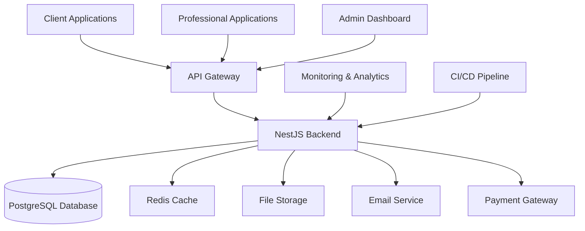
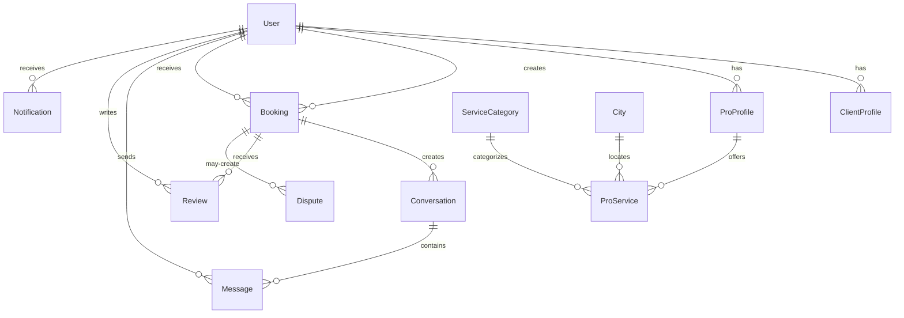
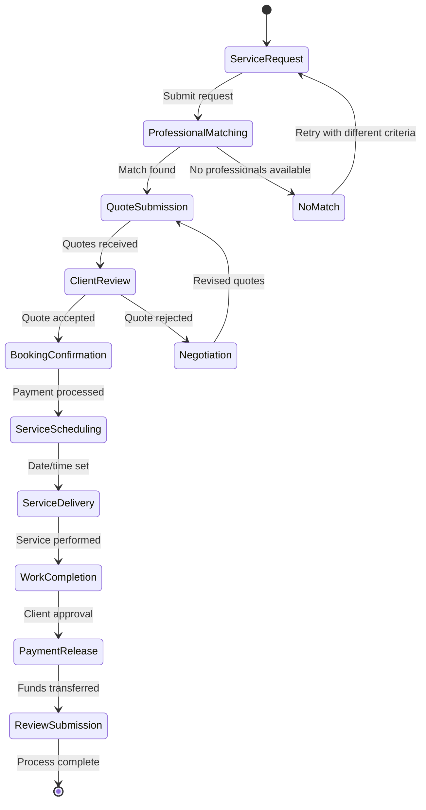
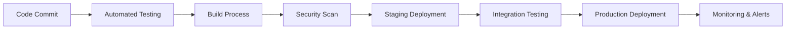

# Khadamat Platform - Carnet de Charge (Specification Document)

## Table of Contents
1. [Project Overview](#project-overview)
2. [Objectives](#objectives)
3. [Target Users](#target-users)
4. [Technical Architecture](#technical-architecture)
5. [Features and Functionalities](#features-and-functionalities)
6. [Business Logic](#business-logic)
7. [Technologies Used](#technologies-used)
8. [Security and Compliance](#security-and-compliance)
9. [Deployment and Operations](#deployment-and-operations)
10. [Performance Requirements](#performance-requirements)
11. [Design System](#design-system)

---

## Project Overview

**Khadamat** is a comprehensive digital marketplace platform connecting Moroccan clients with verified professional service providers for home services. The platform serves as a trusted intermediary, facilitating seamless connections between homeowners and skilled professionals across various service categories including plumbing, electrical work, cleaning, painting, gardening, and masonry.

### Vision
To become Morocco's leading digital marketplace for home services, providing a trustworthy, efficient, and user-friendly platform that connects clients with verified professionals while ensuring quality service delivery and fair compensation.

### Mission
Democratize access to professional home services across Morocco by creating a digital ecosystem that prioritizes trust, transparency, and quality while supporting local professionals in growing their businesses.

### Market Context
- **Target Market**: Moroccan homeowners and businesses requiring home maintenance and improvement services
- **Service Area**: All major Moroccan cities (Casablanca, Rabat, Marrakech, Fès, Tangier, Agadir, Meknès, Oujda)
- **Competitive Advantage**: Local focus, Arabic/French bilingual support, comprehensive verification system, mobile-first design

---

## Objectives

### Primary Objectives
1. **Trust Building**: Establish Khadamat as the most trusted home services platform in Morocco through rigorous professional verification and quality assurance processes
2. **Market Penetration**: Achieve 15% market share in major Moroccan cities within 3 years
3. **User Experience**: Deliver a 4.8+ star average rating across all user touchpoints
4. **Professional Empowerment**: Enable 10,000+ verified professionals to grow their businesses through the platform

### Secondary Objectives
1. **Digital Inclusion**: Bridge the digital divide by providing accessible services to underserved communities
2. **Economic Impact**: Contribute to local economies by supporting small and medium-sized professional businesses
3. **Innovation Leadership**: Pioneer digital transformation in Morocco's service industry
4. **Sustainability**: Promote eco-friendly service practices and materials

### Success Metrics
- **User Acquisition**: 50,000+ active users within 2 years
- **Professional Onboarding**: 5,000+ verified professionals
- **Transaction Volume**: 100,000+ completed services annually
- **Revenue Growth**: 300% year-over-year growth
- **Customer Satisfaction**: 95%+ satisfaction rate

---

## Target Users

### Primary User Segments

#### 1. **Individual Clients (B2C)**
- **Profile**: Moroccan homeowners, renters, and small business owners
- **Demographics**: Age 25-65, middle-income households, urban and suburban residents
- **Needs**: Reliable, affordable, and convenient home service solutions
- **Pain Points**: Difficulty finding trustworthy professionals, language barriers, lack of transparency in pricing
- **Usage Patterns**: Emergency repairs, scheduled maintenance, home improvement projects

#### 2. **Professional Service Providers (B2B2C)**
- **Profile**: Licensed tradespeople, independent contractors, small service businesses
- **Specializations**: Plumbing, electrical, cleaning, painting, gardening, masonry, appliance repair
- **Business Size**: 1-10 employees, local service areas
- **Needs**: Steady client acquisition, fair pricing, payment security, reputation management
- **Pain Points**: Client acquisition costs, payment delays, inconsistent demand

### Secondary User Segments

#### 3. **Property Managers**
- **Profile**: Residential and commercial property management companies
- **Needs**: Bulk service bookings, maintenance scheduling, quality assurance
- **Volume**: High-frequency, recurring services

#### 4. **Real Estate Professionals**
- **Profile**: Real estate agents, property developers
- **Needs**: Pre-sale home inspections, move-in/move-out cleaning, property staging services

### User Journey Mapping

#### Client Journey
1. **Discovery**: Search for services via website/mobile app
2. **Research**: Compare professionals, read reviews, check verification status
3. **Booking**: Submit service request with details and photos
4. **Communication**: Chat with professionals, clarify requirements
5. **Service Delivery**: Professional arrives, completes work
6. **Payment & Review**: Secure payment, rate and review experience

#### Professional Journey
1. **Registration**: Create profile, submit verification documents
2. **Verification**: Complete background checks and skill assessments
3. **Profile Setup**: Define services, pricing, availability, portfolio
4. **Lead Generation**: Receive service requests via platform
5. **Client Interaction**: Communicate, quote, schedule services
6. **Service Delivery**: Complete work, receive payment
7. **Reputation Building**: Earn reviews, improve profile ranking

---

## Technical Architecture

### System Architecture Overview



### Backend Architecture

#### Core Framework: NestJS
- **Framework**: NestJS (Node.js framework)
- **Language**: TypeScript
- **Architecture Pattern**: Modular monolith with microservices-ready structure
- **Database ORM**: Prisma
- **Authentication**: JWT with Passport.js
- **Validation**: Class-validator with class-transformer
- **Documentation**: Swagger/OpenAPI

#### Module Structure
```
src/
├── modules/
│   ├── auth/           # Authentication & authorization
│   ├── users/          # User management
│   ├── client/         # Client-specific features
│   ├── pro/            # Professional features
│   ├── bookings/       # Service booking system
│   ├── messaging/      # Real-time messaging
│   ├── reviews/        # Review and rating system
│   ├── disputes/       # Dispute resolution
│   ├── notifications/  # Push notifications
│   ├── subscriptions/  # Professional subscriptions
│   ├── payments/       # Payment processing
│   ├── locations/      # Geographic services
│   ├── services/       # Service categories
│   ├── statistics/     # Analytics and reporting
│   └── health/         # System health monitoring
├── common/             # Shared utilities
├── config/             # Configuration management
└── interceptors/       # Request/response interceptors
```

### Frontend Architecture

#### Core Framework: Next.js
- **Framework**: Next.js 14+ (React framework)
- **Language**: TypeScript
- **Styling**: Tailwind CSS
- **State Management**: Zustand
- **Data Fetching**: TanStack Query (React Query)
- **Animation**: Framer Motion
- **UI Components**: Custom component library

#### Application Structure
```
khadamat-frontend/
├── app/                    # Next.js app router
│   ├── (auth)/            # Authentication pages
│   ├── (client)/          # Client dashboard
│   ├── (pro)/             # Professional dashboard
│   ├── (public)/          # Public pages
│   └── api/               # API routes
├── components/            # Reusable components
│   ├── ui/               # Base UI components
│   ├── client/           # Client-specific components
│   ├── pro/              # Professional components
│   └── sections/         # Page sections
├── lib/                   # Utilities and configurations
│   ├── design-tokens/    # Design system tokens
│   ├── hooks/            # Custom React hooks
│   ├── services/         # API service layer
│   └── utils/            # Helper functions
└── public/               # Static assets
```

### Database Architecture

#### Primary Database: PostgreSQL
- **Engine**: PostgreSQL 15+
- **ORM**: Prisma
- **Migration Strategy**: Version-controlled migrations
- **Backup Strategy**: Daily automated backups with point-in-time recovery

#### Key Entities Relationship


#### Caching Strategy: Redis
- **Session Storage**: JWT tokens and user sessions
- **Rate Limiting**: API request throttling
- **Cache Layers**: Database query results, computed data
- **Pub/Sub**: Real-time notifications and messaging

### Infrastructure Architecture

#### Cloud Infrastructure
- **Provider**: AWS/Google Cloud/Azure (TBD based on cost analysis)
- **Compute**: Containerized applications (Docker + Kubernetes)
- **Database**: Managed PostgreSQL service
- **Cache**: Managed Redis service
- **Storage**: Object storage for files and images
- **CDN**: Global content delivery for static assets

#### DevOps Pipeline
- **CI/CD**: GitHub Actions / GitLab CI
- **Containerization**: Docker
- **Orchestration**: Kubernetes
- **Monitoring**: Prometheus + Grafana
- **Logging**: ELK Stack (Elasticsearch, Logstash, Kibana)
- **Security**: Automated security scanning and compliance checks

---

## Features and Functionalities

### Core Platform Features

#### 1. User Management System
- **Registration**: Email/phone verification, role-based signup
- **Authentication**: JWT-based auth with refresh tokens
- **Authorization**: Role-based access control (Client, Pro, Admin)
- **Profile Management**: Comprehensive user profiles with preferences
- **Account Recovery**: Secure password reset with email verification

#### 2. Professional Verification System
- **Document Verification**: ID, licenses, insurance, certifications
- **Background Checks**: Criminal record verification
- **Skill Assessment**: Category-specific competency tests
- **Reference Validation**: Previous client references
- **Badge System**: Trust indicators (Verified, Top Rated, Experienced, etc.)

#### 3. Service Discovery & Booking
- **Advanced Search**: Location-based, category-based, price range filtering
- **Professional Profiles**: Detailed profiles with portfolios, reviews, pricing
- **Real-time Availability**: Calendar integration with booking slots
- **Instant Booking**: One-click booking with smart defaults
- **Bulk Booking**: Multiple services, recurring bookings

#### 4. Communication System
- **Real-time Messaging**: WebSocket-based chat system
- **File Sharing**: Photo uploads for service requests and progress updates
- **Automated Notifications**: Booking confirmations, reminders, status updates
- **Multilingual Support**: Arabic and French language options
- **Voice Messages**: Audio messaging for complex instructions

#### 5. Review & Rating System
- **Five-star Ratings**: Overall service quality assessment
- **Detailed Reviews**: Text feedback with photo evidence
- **Review Verification**: Authenticated client reviews only
- **Response System**: Professionals can respond to reviews
- **Review Analytics**: Performance insights for professionals

### Advanced Features (Premium Implementation)

#### 6. AI-Powered Recommendations
- **Personalized Suggestions**: Machine learning-based service recommendations
- **Dynamic Pricing**: AI-optimized pricing suggestions for professionals
- **Demand Prediction**: Seasonal and local demand forecasting
- **Quality Scoring**: Automated quality assessment from reviews and data

#### 7. Professional Dashboard
- **Business Analytics**: Revenue tracking, client insights, performance metrics
- **Customizable Layout**: Drag-and-drop dashboard widgets
- **Lead Management**: Automated lead qualification and prioritization
- **Marketing Tools**: Profile optimization suggestions, promotion features

#### 8. Client Dashboard
- **Booking History**: Comprehensive service history with search and filtering
- **Favorite Professionals**: Save and quickly rebook trusted professionals
- **Service Reminders**: Automated maintenance reminders
- **Budget Tracking**: Spending analytics and budget planning

#### 9. Subscription Management
- **Tiered Plans**: Basic, Premium, Enterprise professional subscriptions
- **Feature Access**: Premium features based on subscription level
- **Payment Processing**: Automated recurring billing
- **Usage Analytics**: Subscription utilization and ROI tracking

#### 10. Dispute Resolution System
- **Automated Mediation**: AI-assisted dispute categorization
- **Evidence Collection**: Structured evidence submission process
- **Resolution Tracking**: Transparent dispute status and outcomes
- **Escalation Process**: Admin intervention for complex cases

### Mobile-Specific Features

#### 11. Progressive Web App (PWA)
- **Offline Capability**: Core functionality without internet
- **Push Notifications**: Real-time updates and reminders
- **Camera Integration**: Photo capture for service requests
- **Location Services**: GPS-based service area detection
- **Biometric Authentication**: Fingerprint/Face ID login

#### 12. Mobile-Optimized UX
- **Bottom Navigation**: iOS/Android native navigation patterns
- **Touch Gestures**: Swipe actions, pinch-to-zoom
- **Voice Commands**: Voice-activated service requests
- **Emergency Mode**: Priority booking for urgent repairs

---

## Business Logic

### Service Booking Workflow



### Professional Onboarding Process

1. **Account Creation**: Basic information and contact details
2. **Document Submission**: ID, licenses, insurance certificates
3. **Verification Process**: Manual review and background checks
4. **Service Configuration**: Define offered services, pricing, availability
5. **Profile Completion**: Portfolio, description, service areas
6. **Training Completion**: Platform usage and best practices
7. **Live Activation**: Account goes live with first booking eligibility

### Payment Flow Logic

#### Client Payment Process
1. **Quote Acceptance**: Client approves professional's quote
2. **Payment Authorization**: Secure payment method setup
3. **Fund Holding**: Platform holds funds in escrow
4. **Service Completion**: Client confirms satisfactory work
5. **Fund Release**: Automatic transfer to professional
6. **Platform Fee**: Deduction of service fee (typically 10-15%)

#### Professional Payout Process
1. **Weekly/Monthly Cycles**: Regular payout schedules
2. **Minimum Thresholds**: Accumulate earnings before payout
3. **Verification Requirements**: Account verification for large payouts
4. **Tax Documentation**: Automatic generation of 1099-style forms
5. **Multiple Payment Methods**: Bank transfer, mobile money, digital wallets

### Quality Assurance Logic

#### Professional Rating Algorithm
```
Final Rating = (Client Reviews × 0.7) + (Platform Metrics × 0.2) + (Verification Score × 0.1)

Where:
- Client Reviews: Average of all 5-star ratings
- Platform Metrics: On-time delivery, response rate, completion rate
- Verification Score: Document verification completeness
```

#### Service Quality Metrics
- **Response Time**: < 2 hours for initial response
- **Completion Rate**: > 95% services completed successfully
- **Client Satisfaction**: > 4.5 average rating
- **Dispute Rate**: < 2% of total bookings

### Notification Logic

#### Automated Triggers
- **Booking Requests**: Immediate notification to matched professionals
- **Quote Submissions**: Real-time updates to clients
- **Status Changes**: All booking status transitions
- **Message Alerts**: New messages in conversations
- **Payment Confirmations**: Successful transactions
- **Review Reminders**: Post-service review requests

#### Personalization Rules
- **Frequency Settings**: User-controlled notification preferences
- **Channel Preferences**: Email, SMS, push notification options
- **Quiet Hours**: Respect user-defined silent periods
- **Language Settings**: Bilingual notification support

---

## Technologies Used

### Backend Technologies

#### Core Framework & Runtime
- **Node.js**: 18.17+ LTS
- **NestJS**: 10.0+ (Progressive Node.js framework)
- **TypeScript**: 5.0+ (Type-safe JavaScript)

#### Database & Data Management
- **PostgreSQL**: 15+ (Primary relational database)
- **Prisma**: 5.0+ (Next-generation ORM)
- **Redis**: 7.0+ (Caching and session storage)

#### Authentication & Security
- **JWT**: JSON Web Tokens for authentication
- **Passport.js**: Authentication middleware
- **bcrypt**: Password hashing
- **Helmet**: Security headers
- **Rate Limiting**: express-rate-limit

#### API & Communication
- **RESTful APIs**: Standard HTTP methods
- **WebSocket**: Real-time messaging (Socket.io)
- **Swagger/OpenAPI**: API documentation
- **Class Validator**: Request validation
- **Class Transformer**: Object transformation

#### External Integrations
- **Stripe/PayPal**: Payment processing
- **Twilio/SendGrid**: SMS and email services
- **Cloudinary**: Media storage and optimization
- **Google Maps**: Location services and mapping

### Frontend Technologies

#### Core Framework
- **Next.js**: 14+ (React framework with App Router)
- **React**: 18+ (UI library)
- **TypeScript**: 5.0+ (Type safety)

#### Styling & Design
- **Tailwind CSS**: 3.3+ (Utility-first CSS framework)
- **Framer Motion**: 10+ (Animation library)
- **Lucide React**: Icon library
- **Headless UI**: Accessible UI components

#### State Management & Data
- **Zustand**: 4.4+ (Lightweight state management)
- **TanStack Query**: 5.0+ (Server state management)
- **React Hook Form**: Form handling with validation
- **Zod**: Schema validation

#### Development Tools
- **ESLint**: Code linting
- **Prettier**: Code formatting
- **Husky**: Git hooks
- **Jest**: Testing framework
- **Cypress**: E2E testing

### Infrastructure & DevOps

#### Containerization & Orchestration
- **Docker**: 24+ (Container platform)
- **Kubernetes**: Container orchestration
- **Helm**: Package management for Kubernetes

#### Cloud Services
- **AWS/GCP/Azure**: Cloud platform (TBD)
- **Vercel**: Frontend deployment
- **Railway/Render**: Backend deployment options

#### Monitoring & Analytics
- **Sentry**: Error tracking and performance monitoring
- **Prometheus**: Metrics collection
- **Grafana**: Visualization and alerting
- **Google Analytics**: User analytics

#### CI/CD Pipeline
- **GitHub Actions**: CI/CD automation
- **Docker Hub**: Container registry
- **Vercel**: Frontend deployment automation

### Mobile Technologies

#### Progressive Web App (PWA)
- **Service Workers**: Offline functionality
- **Web App Manifest**: Native app-like experience
- **Push Notifications**: Real-time updates

#### Mobile Optimization
- **Responsive Design**: Mobile-first approach
- **Touch Gestures**: Swipe and tap interactions
- **Camera API**: Photo capture integration
- **Geolocation API**: Location-based services

---

## Security and Compliance

### Data Protection

#### GDPR Compliance (European Data Protection)
- **Data Minimization**: Collect only necessary user data
- **Purpose Limitation**: Clear data usage policies
- **Consent Management**: Granular user consent controls
- **Right to Access**: User data export functionality
- **Right to Deletion**: Account deletion with data removal
- **Data Portability**: Data export in standard formats

#### Moroccan Data Protection Law Compliance
- **Personal Data Protection**: Compliance with Moroccan data protection regulations
- **Data Localization**: Consideration for local data storage requirements
- **Privacy by Design**: Security integrated into system architecture

### Authentication & Authorization

#### Multi-Factor Authentication (MFA)
- **SMS-based 2FA**: Phone number verification
- **Email-based 2FA**: Secondary email verification
- **Biometric Authentication**: Fingerprint/Face ID support
- **Hardware Security Keys**: FIDO2/WebAuthn support

#### Role-Based Access Control (RBAC)
- **User Roles**: Client, Professional, Admin, Moderator
- **Permission Levels**: Granular permission system
- **API Scopes**: Token-based API access control
- **Session Management**: Secure session handling with timeouts

### Payment Security

#### PCI DSS Compliance
- **Tokenization**: Sensitive payment data never stored
- **Encryption**: End-to-end encryption for payment processing
- **Secure Payment Gateway**: Certified payment processor integration
- **Fraud Detection**: Automated fraud monitoring and prevention

#### Financial Safeguards
- **Escrow System**: Funds held securely until service completion
- **Dispute Protection**: Buyer and seller protection policies
- **Chargeback Handling**: Automated dispute resolution process
- **Financial Reporting**: Transparent fee structure and reporting

### Platform Security

#### Infrastructure Security
- **Network Security**: VPC isolation, security groups, WAF
- **Application Security**: Input validation, XSS prevention, CSRF protection
- **Database Security**: Encrypted data at rest and in transit
- **API Security**: Rate limiting, API key management, request signing

#### Operational Security
- **Access Control**: Principle of least privilege
- **Audit Logging**: Comprehensive security event logging
- **Incident Response**: 24/7 security monitoring and response
- **Regular Security Audits**: Quarterly security assessments

### Professional Verification

#### Identity Verification
- **Document Authentication**: Government ID verification
- **Address Verification**: Proof of address validation
- **License Verification**: Professional certification validation
- **Background Checks**: Criminal record and reference checks

#### Service Quality Assurance
- **Insurance Verification**: Liability insurance confirmation
- **Skill Certification**: Industry-standard certification validation
- **Performance Monitoring**: Ongoing quality and safety metrics
- **Client Feedback Integration**: Review-based quality assessment

### Content Security

#### User-Generated Content
- **Content Moderation**: Automated and manual content review
- **Image Processing**: Safe image handling and optimization
- **Text Filtering**: Profanity and spam detection
- **Review Authenticity**: Verified review system

#### Communication Security
- **End-to-End Encryption**: Secure messaging between users
- **Message Encryption**: Database-level message encryption
- **File Security**: Secure file upload and storage
- **Privacy Controls**: User-controlled communication preferences

---

## Deployment and Operations

### Development Workflow

#### Version Control
- **Git Flow**: Feature branches, develop, main branches
- **Pull Requests**: Code review requirements
- **Automated Testing**: CI/CD pipeline with test automation
- **Code Quality**: ESLint, Prettier, SonarQube integration

#### Environment Management
- **Development**: Local development environment
- **Staging**: Pre-production testing environment
- **Production**: Live production environment
- **Disaster Recovery**: Backup production environment

### Deployment Strategy

#### Continuous Integration/Continuous Deployment (CI/CD)


#### Infrastructure as Code
- **Terraform**: Infrastructure provisioning
- **Docker**: Containerization
- **Kubernetes**: Container orchestration
- **Helm Charts**: Application deployment

### Monitoring and Observability

#### Application Monitoring
- **Performance Metrics**: Response times, throughput, error rates
- **Business Metrics**: User engagement, conversion rates, revenue
- **System Health**: CPU, memory, disk usage, network I/O
- **User Experience**: Real user monitoring, session recordings

#### Logging Strategy
- **Structured Logging**: JSON-formatted logs with context
- **Log Aggregation**: Centralized log collection and analysis
- **Log Retention**: Configurable retention policies
- **Log Analysis**: Automated anomaly detection and alerting

#### Alerting System
- **Critical Alerts**: System downtime, security breaches
- **Performance Alerts**: Slow response times, high error rates
- **Business Alerts**: Revenue drops, user engagement issues
- **Operational Alerts**: Infrastructure issues, capacity warnings

### Backup and Recovery

#### Data Backup Strategy
- **Database Backups**: Daily full backups, hourly incremental
- **File Backups**: User-uploaded content backup
- **Configuration Backups**: Infrastructure and application config
- **Cross-Region Replication**: Disaster recovery readiness

#### Recovery Procedures
- **RTO (Recovery Time Objective)**: 4 hours for critical systems
- **RPO (Recovery Point Objective)**: 1 hour data loss tolerance
- **Failover Procedures**: Automated failover for high availability
- **Business Continuity**: Comprehensive disaster recovery plan

### Scaling Strategy

#### Horizontal Scaling
- **Load Balancing**: Application and database load distribution
- **Auto-scaling**: Automatic resource scaling based on demand
- **Microservices Ready**: Architecture prepared for service decomposition
- **Global CDN**: Content delivery network for static assets

#### Performance Optimization
- **Database Optimization**: Query optimization, indexing, caching
- **API Optimization**: Response compression, pagination, rate limiting
- **Frontend Optimization**: Code splitting, lazy loading, image optimization
- **Caching Strategy**: Multi-layer caching (CDN, application, database)

---

## Performance Requirements

### Application Performance

#### Response Time Targets
- **API Response Time**: < 200ms for simple requests
- **Page Load Time**: < 2.5 seconds (Lighthouse P95)
- **Time to Interactive**: < 3 seconds
- **Database Query Time**: < 100ms average

#### Core Web Vitals
- **Largest Contentful Paint (LCP)**: < 2.5 seconds
- **First Input Delay (FID)**: < 100 milliseconds
- **Cumulative Layout Shift (CLS)**: < 0.1

### Scalability Requirements

#### User Load Capacity
- **Concurrent Users**: Support 10,000+ simultaneous users
- **Daily Active Users**: Handle 100,000+ daily active users
- **Peak Load**: 50,000 concurrent users during peak hours
- **API Throughput**: 1,000+ requests per second

#### Database Performance
- **Read Operations**: 10,000+ reads per second
- **Write Operations**: 1,000+ writes per second
- **Connection Pool**: Optimized connection pooling
- **Query Optimization**: Sub-100ms query response times

### Mobile Performance

#### Mobile-Specific Targets
- **Mobile Page Load**: < 3 seconds on 3G networks
- **App Size**: < 5MB initial bundle size
- **Offline Functionality**: Core features work offline
- **Battery Impact**: Minimal battery drain

### Reliability Requirements

#### Uptime and Availability
- **Service Level Agreement (SLA)**: 99.9% uptime
- **Monthly Downtime**: < 43 minutes
- **Error Rate**: < 0.1% of total requests
- **Recovery Time**: < 15 minutes for service restoration

---

## Design System

### Visual Identity

#### Color Palette
```typescript
const colors = {
  // Primary Brand Colors
  primary: {
    50: '#fff7ed',   // Very light orange
    100: '#ffedd5',  // Light orange
    500: '#F97B22',  // Main primary orange (#F97B22)
    600: '#ea580c',  // Hover state
    700: '#c2410c',  // Active state
    900: '#9a3412',  // Dark state
  },

  // Neutral Backgrounds
  background: '#FAF7F2',  // Main background (cream)
  surface: '#EDEEEF',     // Card backgrounds

  // Text Colors
  text: {
    primary: '#3B3B3B',   // Main text
    secondary: '#6B7280', // Secondary text
    muted: '#9CA3AF',     // Muted text
  },

  // Semantic Colors
  success: '#10B981',     // Green
  warning: '#F59E0B',     // Amber
  error: '#EF4444',       // Red
}
```

#### Typography System
```typescript
const typography = {
  fonts: {
    heading: ['Poppins', 'sans-serif'],
    body: ['Manrope', 'sans-serif'],
    arabic: ['Tajawal', 'sans-serif'],
  },

  sizes: {
    display: { fontSize: '3rem', lineHeight: '3.25rem' },    // 48px
    h1: { fontSize: '2.625rem', lineHeight: '2.75rem' },     // 42px
    h2: { fontSize: '1.875rem', lineHeight: '2.25rem' },     // 30px
    h3: { fontSize: '1.375rem', lineHeight: '1.75rem' },     // 22px
    body: { fontSize: '1rem', lineHeight: '1.5rem' },        // 16px
    small: { fontSize: '0.875rem', lineHeight: '1.25rem' },  // 14px
  }
}
```

### Component Architecture

#### Atomic Design Principles
- **Atoms**: Buttons, inputs, icons, colors
- **Molecules**: Form fields, cards, navigation items
- **Organisms**: Header, footer, dashboards, forms
- **Templates**: Page layouts, dashboard templates
- **Pages**: Complete page implementations

#### Responsive Breakpoints
```typescript
const breakpoints = {
  xs: '320px',   // Mobile small
  sm: '640px',   // Mobile large
  md: '768px',   // Tablet
  lg: '1024px',  // Desktop small
  xl: '1280px',  // Desktop large
}
```

### Accessibility Standards

#### WCAG 2.1 AA Compliance
- **Color Contrast**: Minimum 4.5:1 ratio for normal text
- **Focus Indicators**: Visible focus outlines on all interactive elements
- **Keyboard Navigation**: Full keyboard accessibility
- **Screen Reader Support**: Proper ARIA labels and semantic HTML
- **Touch Targets**: Minimum 44px touch targets

#### Inclusive Design Features
- **Reduced Motion**: Respect user's motion preferences
- **High Contrast Mode**: Support for high contrast themes
- **Font Scaling**: Support for larger text sizes
- **Language Support**: Arabic (RTL) and French (LTR) layouts

### Animation System

#### Motion Principles
- **Purposeful**: Every animation serves a functional purpose
- **Consistent**: Standardized timing and easing functions
- **Performant**: GPU-accelerated animations
- **Accessible**: Reduced motion support

#### Animation Tokens
```typescript
const motion = {
  duration: {
    fast: '150ms',
    normal: '300ms',
    slow: '500ms',
  },
  easing: {
    easeOut: 'cubic-bezier(0.4, 0, 0.2, 1)',
    easeIn: 'cubic-bezier(0.4, 0, 1, 1)',
    bounce: 'cubic-bezier(0.68, -0.55, 0.265, 1.55)',
  }
}
```

---

*This specification document serves as the comprehensive technical and business requirements for the Khadamat platform implementation. All development, design, and operational decisions should align with the guidelines and requirements outlined in this document.*

*Version: 1.0.0 | Date: November 2024 | Author: Khadamat Development Team*