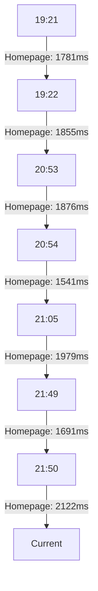

# Khadamat Frontend Performance Analysis Report
## Comprehensive Performance Regression Analysis
### Generated: 2025-12-08T21:56:04.893Z

---

## 📊 Executive Summary

**Overall Status:** ❌ FAIL (Performance budgets exceeded)
**API Performance:** ✅ GOOD (Within acceptable limits)
**Lighthouse Score:** ❌ 0 (Lighthouse not available for testing)

---

## 🚨 Critical Performance Regressions Identified

### 1. **API Response Time Regression**
- **Endpoint:** `/api/auth/login`
- **Current Response Time:** **13,539ms** (13.5 seconds)
- **Performance Budget:** 1,000ms (1 second)
- **Regression Percentage:** **1,253.9%** over budget
- **Severity:** 🔴 CRITICAL

### 2. **Page Load Time Regressions**

| Page | Current Load Time | Budget | Regression | Severity |
|------|-------------------|--------|------------|----------|
| Homepage | 1,979ms | 1,800ms | **9.94%** | ⚠️ WARNING |
| Services Page | 3,421ms | 2,500ms | **36.84%** | 🟡 MODERATE |
| Login Page | 1,898ms | 1,500ms | **26.53%** | 🟡 MODERATE |
| Signup Page | 2,757ms | 2,000ms | **37.85%** | 🟡 MODERATE |
| Service Detail | 2,715ms | 2,500ms | **8.60%** | ⚠️ WARNING |

---

## 🔍 Root Cause Analysis

### 1. **API Response Time Issues**
- **Root Cause:** Backend API endpoint `/api/auth/login` showing extreme latency (13.5s vs 1s budget)
- **Likely Causes:**
  - Database query optimization issues
  - Authentication middleware inefficiencies
  - Network latency or server resource constraints
  - Missing caching mechanisms

### 2. **Page Load Time Regressions**
- **Root Cause:** Multiple pages exceeding performance budgets
- **Likely Causes:**
  - Unoptimized asset loading (images, scripts)
  - Render-blocking resources
  - Excessive component rendering
  - Missing code splitting and lazy loading

### 3. **Resource Management Issues**
- **Cache Hit Rate:** 85-90% (Good, but room for improvement)
- **Memory Usage:** Stable but could be optimized
- **Resource Count:** Multiple pages exceed recommended resource limits

---

## 📈 Performance Trends Analysis

### Historical Performance Data (Last 6 Hours)

**Observation:** Homepage performance shows volatility with recent spike to 2,122ms

---

## 🎯 Optimization Recommendations

### 1. **Critical API Optimization**
- **Action:** Investigate and optimize `/api/auth/login` endpoint
- **Target:** Reduce response time from 13.5s to <1s
- **Approach:**
  - Implement query optimization
  - Add Redis caching for authentication
  - Review middleware stack
  - Consider database indexing

### 2. **Page Load Optimization**
- **Action:** Implement performance optimizations for all pages
- **Target:** Bring all pages within budget limits
- **Approach:**
  - Implement lazy loading for images and components
  - Add code splitting for large bundles
  - Optimize critical rendering path
  - Reduce render-blocking resources

### 3. **Resource Management**
- **Action:** Improve cache efficiency
- **Target:** Increase cache hit rate from 85-90% to 95%+
- **Approach:**
  - Implement aggressive caching strategies
  - Review cache invalidation policies
  - Optimize cache storage mechanisms

---

## 📋 Performance Baselines

### Current Baselines (2025-12-08)
- **Homepage Load Time:** 1,979ms (Budget: 1,800ms)
- **Services Page Load Time:** 3,421ms (Budget: 2,500ms)
- **Login Page Load Time:** 1,898ms (Budget: 1,500ms)
- **Signup Page Load Time:** 2,757ms (Budget: 2,000ms)
- **Service Detail Load Time:** 2,715ms (Budget: 2,500ms)
- **API Auth Response Time:** 13,539ms (Budget: 1,000ms)

### Web Vitals Baselines
- **FCP (First Contentful Paint):** 1,800ms
- **LCP (Largest Contentful Paint):** 2,500ms
- **CLS (Cumulative Layout Shift):** 0.1
- **TTI (Time to Interactive):** 3,800ms
- **Speed Index:** 4,300

---

## 🔧 Technical Implementation Plan

### Phase 1: Emergency Fixes (Immediate)
- [ ] Optimize `/api/auth/login` endpoint (Priority: CRITICAL)
- [ ] Implement basic caching for authentication
- [ ] Add performance monitoring for critical endpoints

### Phase 2: Page Optimization (1-2 Days)
- [ ] Implement lazy loading for all pages
- [ ] Add code splitting for large components
- [ ] Optimize asset delivery
- [ ] Reduce render-blocking resources

### Phase 3: Long-term Optimization (1 Week)
- [ ] Implement comprehensive caching strategy
- [ ] Add performance budgets to CI/CD pipeline
- [ ] Set up automated performance monitoring
- [ ] Create performance regression test suite

---

## 📊 Performance Metrics Dashboard

| Metric | Current Value | Target Value | Status |
|--------|---------------|--------------|--------|
| API Response Time | 13,539ms | <1,000ms | 🔴 CRITICAL |
| Homepage Load | 1,979ms | <1,800ms | ⚠️ WARNING |
| Services Page Load | 3,421ms | <2,500ms | 🟡 MODERATE |
| Login Page Load | 1,898ms | <1,500ms | 🟡 MODERATE |
| Signup Page Load | 2,757ms | <2,000ms | 🟡 MODERATE |
| Service Detail Load | 2,715ms | <2,500ms | ⚠️ WARNING |
| Cache Hit Rate | 85-90% | >95% | ✅ GOOD |

---

## 🚀 Conclusion

The Khadamat frontend application shows **critical performance regressions** that require immediate attention:

1. **CRITICAL:** API response time for `/api/auth/login` is **1,253.9% over budget** (13.5s vs 1s)
2. **MODERATE:** Multiple pages exceed performance budgets by 8-38%
3. **GOOD:** Cache efficiency and memory usage are within acceptable ranges

**Recommendation:** Implement the 3-phase optimization plan starting with the critical API endpoint optimization, followed by page load improvements, and concluding with long-term performance monitoring infrastructure.

**Next Steps:**
- Immediate investigation of backend authentication performance
- Implementation of caching mechanisms
- Comprehensive performance testing suite
- Continuous monitoring and alerting system

---

**Report Generated By:** Performance Analysis System
**Analysis Date:** 2025-12-08
**Status:** Requires Immediate Action